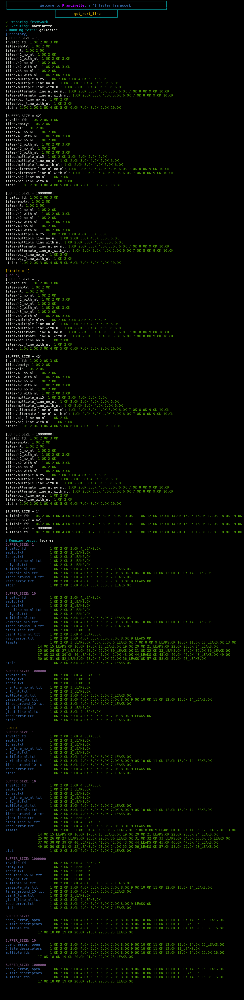

<h2>About: 📖</h2>
  The objective of the project is to create a function that receives an FD (file descriptor), and within that FD it returns the first line of the file and each time this function is called it returns the next line.
   The problem is that we can only use 9 auxiliary functions and we have few libraries available.
  <h4>Note: 🏅 125/100 </h4>
<h2>Francinette test:</h2>
<h4>gnlTester (https://github.com/Tripouille/gnlTester)</h4>
<h4>fsoares (https://github.com/xicodomingues/francinette)</h4>

